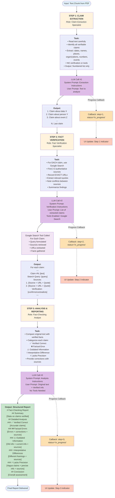

# Textbook Analysis

## Process Flowchart

```mermaid
graph TB
    Start([Input: Text Chunk from PDF]) --> Step1Init[<b>STEP 1: CLAIM EXTRACTION</b><br/>Role: Claim Extraction Specialist]
    
    Step1Init --> Step1Task["<b>Task:</b><br/>• Read text carefully<br/>• Identify all verifiable claims<br/>• Extract: dates, names, places,<br/>  organizations, numbers, events<br/>• NO verification or tools<br/>• Output: Numbered list only"]
    
    Step1Task --> Step1Execute[LLM Call #1<br/>System Prompt: Extraction Instructions<br/>User Prompt: Text to analyze]
    
    Step1Execute --> Step1Output["<b>Output:</b><br/>1. Claim about date X<br/>2. Claim about person Y<br/>3. Claim about event Z<br/>...<br/>N. Last claim"]
    
    Step1Output --> Step2Init[<b>STEP 2: FACT VERIFICATION</b><br/>Role: Fact Verification Specialist]
    
    Step2Init --> Step2Task["<b>Task:</b><br/>• For EACH claim, use Google Search<br/>• Find 2-3 authoritative sources<br/>• Record EXACT URLs<br/>• Extract relevant quotes<br/>• Note conflicts between sources<br/>• Summarize findings"]
    
    Step2Task --> Step2Execute[LLM Call #2<br/>System Prompt: Verification Instructions<br/>User Prompt: List of extracted claims<br/>Tools Enabled: Google Search]
    
    Step2Execute --> Step2Search[Google Search Tool Called<br/>For Each Claim:<br/>• Query formulated<br/>• Sources retrieved<br/>• URLs extracted<br/>• Facts gathered]
    
    Step2Search --> Step2Output["<b>Output:</b><br/>For each claim:<br/>---<br/>Claim #N: [text]<br/>Search Query: [query]<br/>Sources:<br/>  1. [Source + URL + Quote]<br/>  2. [Source + URL + Quote]<br/>Verification: [confirms/contradicts]<br/>---"]
    
    Step2Output --> Step3Init[<b>STEP 3: ANALYSIS & REPORTING</b><br/>Role: Fact-Checking Analyst]
    
    Step3Init --> Step3Task["<b>Task:</b><br/>• Compare original text with verified facts<br/>• Categorize each claim:<br/>  ✅ Verified Correct<br/>  ❌ Factual Error<br/>  ⚠️ Outdated Information<br/>  ℹ️ Interpretative Difference<br/>  ⚡ Lacks Precision<br/>• Provide corrections with sources"]
    
    Step3Task --> Step3Execute[LLM Call #3<br/>System Prompt: Analysis Instructions<br/>User Prompt: Original text + Verified info<br/>No Tools Needed]
    
    Step3Execute --> Step3Output["<b>Output: Structured Report</b><br/># Fact-Checking Report<br/>## Summary<br/>[Stats on claims verified]<br/>## Detailed Analysis<br/>### ✅ Verified Correct<br/>[Accurate claims]<br/>### ❌ Factual Errors<br/>[Errors + corrections + sources]<br/>### ⚠️ Outdated Information<br/>[Old info + current info + sources]<br/>### ℹ️ Interpretative Differences<br/>[Different framings + sources]<br/>### ⚡ Lacks Precision<br/>[Vague claims + precise info + sources]<br/>## Conclusion<br/>[Overall assessment]"]
    
    Step3Output --> End([Final Report Delivered])
    
    Step1Execute -.->|Progress Callback| CB1[Callback: step=1, status='in_progress']
    Step2Execute -.->|Progress Callback| CB2[Callback: step=2, status='in_progress']
    Step3Execute -.->|Progress Callback| CB3[Callback: step=3, status='in_progress']
    
    CB1 -.-> UI1[UI Update: Step 1 indicator]
    CB2 -.-> UI2[UI Update: Step 2 indicator]
    CB3 -.-> UI3[UI Update: Step 3 indicator]
    
    style Start fill:#e3f2fd
    style End fill:#e3f2fd
    style Step1Init fill:#fff3e0
    style Step2Init fill:#fff3e0
    style Step3Init fill:#fff3e0
    style Step1Execute fill:#e1bee7
    style Step2Execute fill:#e1bee7
    style Step3Execute fill:#e1bee7
    style Step2Search fill:#f3e5f5
    style Step3Output fill:#c8e6c9
    style CB1 fill:#ffe0b2
    style CB2 fill:#ffe0b2
    style CB3 fill:#ffe0b2
    style UI1 fill:#ffccbc
    style UI2 fill:#ffccbc
    style UI3 fill:#ffccbc
```
