# Textbook Analysis

This AI-powered tool verifies the factual accuracy of textbooks, repositories, and documentation.

> **Key Finding:** In a demo analyzing just 56 pages out of 114 pages, the system successfully identified a factual error, proving its capability to precise verification.

**Demo Source:** [NCERT History Class 12 Textbook](https://web.archive.org/web/20260121064733/https://ncert.nic.in/textbook.php?lehs1=0-4)

## Process Flowchart

```mermaid
graph TB
    Start([Input: Text Chunk from PDF]) --> Step1Init[<b>STEP 1: CLAIM EXTRACTION</b><br/>Role: Claim Extraction Specialist]

    Step1Init --> Step1Task["<b>Task:</b><br/>• Read text carefully<br/>• Identify all verifiable claims<br/>• Extract: dates, names, places,<br/>  organizations, numbers, events<br/>• NO verification or tools<br/>• Output: Numbered list only"]

    Step1Task --> Step1Execute[LLM Call #1<br/>System Prompt: Extraction Instructions<br/>User Prompt: Text to analyze]

    Step1Execute --> Step1Output["<b>Output:</b><br/>1. Claim about date X<br/>2. Claim about person Y<br/>3. Claim about event Z<br/>...<br/>N. Last claim"]

    Step1Output --> Step2Init[<b>STEP 2: FACT VERIFICATION</b><br/>Role: Fact Verification Specialist]

    Step2Init --> Step2Task["<b>Task:</b><br/>• For EACH claim, use Search Tools<br/>• Find 2-3 authoritative sources<br/>• <b>Fetch & Read full page content</b><br/>• Record EXACT URLs<br/>• Extract relevant quotes<br/>• Note conflicts between sources"]

    Step2Task --> Step2Execute[LLM Call #2<br/>System Prompt: Verification Instructions<br/>User Prompt: List of extracted claims<br/>Tools Enabled: Google Search, Web Crawler]

    Step2Execute --> Step2Search[Agentic Loop / Tool Calls<br/>For Each Claim:<br/>• Search Request -> Results<br/>• <b>Fetch URL -> Markdown Content</b><br/>• Analyze Content -> Verify Facts]

    Step2Search --> Step2Output["<b>Output:</b><br/>For each claim:<br/>---<br/>Claim #N: [text]<br/>Search Query: [query]<br/>Sources:<br/>  1. [Source + URL + <b>Fetched Content</b>]<br/>  2. [Source + URL + <b>Fetched Content</b>]<br/>Verification: [confirms/contradicts]<br/>---"]

    Step3Init --> Step3Task["<b>Task:</b><br/>• Compare original text with verified facts<br/>• Categorize each claim:<br/>  ✅ Verified Correct<br/>  ❌ Factual Error<br/>  ⚠️ Outdated Information<br/>  ℹ️ Interpretative Difference<br/>  ⚡ Lacks Precision<br/>• Provide corrections with sources"]

    Step3Task --> Step3Execute[LLM Call #3<br/>System Prompt: Analysis Instructions<br/>User Prompt: Original text + Verified info<br/>No Tools Needed]

    Step3Execute --> Step3Output["<b>Output: Structured Report</b><br/># Fact-Checking Report<br/>## Summary<br/>[Stats on claims verified]<br/>## Detailed Analysis<br/>### ✅ Verified Correct<br/>[Accurate claims]<br/>### ❌ Factual Errors<br/>[Errors + corrections + sources]<br/>### ⚠️ Outdated Information<br/>[Old info + current info + sources]<br/>### ℹ️ Interpretative Differences<br/>[Different framings + sources]<br/>### ⚡ Lacks Precision<br/>[Vague claims + precise info + sources]<br/>## Conclusion<br/>[Overall assessment]"]

    Step3Output --> End([Final Report Delivered])

    Step1Execute -.->|Progress Callback| CB1[Callback: step=1, status='in_progress']
    Step2Execute -.->|Progress Callback| CB2[Callback: step=2, status='in_progress']
    Step3Execute -.->|Progress Callback| CB3[Callback: step=3, status='in_progress']

    CB1 -.-> UI1[UI Update: Step 1 indicator]
    CB2 -.-> UI2[UI Update: Step 2 indicator]
    CB3 -.-> UI3[UI Update: Step 3 indicator]

    style Start fill:#1a237e,stroke:#fff,stroke-width:2px,color:#fff
    style End fill:#1a237e,stroke:#fff,stroke-width:2px,color:#fff

    style Step1Init fill:#e65100,stroke:#333,stroke-width:1px,color:#fff
    style Step2Init fill:#e65100,stroke:#333,stroke-width:1px,color:#fff
    style Step3Init fill:#e65100,stroke:#333,stroke-width:1px,color:#fff

    style Step1Execute fill:#4a148c,stroke:#333,stroke-width:1px,color:#fff
    style Step2Execute fill:#4a148c,stroke:#333,stroke-width:1px,color:#fff
    style Step3Execute fill:#4a148c,stroke:#333,stroke-width:1px,color:#fff

    style Step2Search fill:#311b92,stroke:#333,stroke-width:1px,color:#fff
    style Step3Output fill:#1b5e20,stroke:#333,stroke-width:1px,color:#fff

    style CB1 fill:#006064,stroke:#333,stroke-width:1px,color:#fff
    style CB2 fill:#006064,stroke:#333,stroke-width:1px,color:#fff
    style CB3 fill:#006064,stroke:#333,stroke-width:1px,color:#fff

    style UI1 fill:#bf360c,stroke:#333,stroke-width:1px,color:#fff
    style UI2 fill:#bf360c,stroke:#333,stroke-width:1px,color:#fff
    style UI3 fill:#bf360c,stroke:#333,stroke-width:1px,color:#fff

```

## 🌌 Beyond Textbooks: The Power of Intelligent Verification

While this tool demonstrates its prowess on educational material, its core engine is domain-agnostic. The synergy of **creative thought**, **precise prompting**, and **powerful tools** unlocks verification capabilities across any text-heavy domain.

> "We just need a creative thought and the power of good prompts to make AI work better."

### 🚀 Expanding Horizons
We are already applying this architecture to new frontiers:
- **Code Repositories**: Analyzing and verifying library documentation and logic (See: [Python Libraries Analysis](https://github.com/PythonicVarun/py-libraries-analysis))
- **Technical Documentation**: Ensuring API docs match implementation.
- **Legal & Financial Documents**: Cross-referencing clauses and claims against regulations.

This project is a testament that AI, when guided by structured reasoning and robust tool access, becomes an unparalleled engine for truth and accuracy.

## ✍️ Author

**Varun (PythonicVarun)**
- [GitHub](https://github.com/PythonicVarun)

